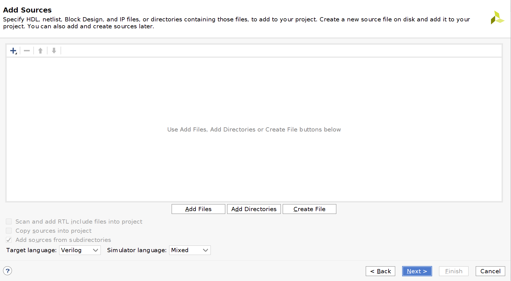

# ARTY_A7_DEMO

Demo of burning a simple adder code on ARTY_A7 (FPGA) using Vivado.

## Prerequisite

- Vivado should be installed on the local machine.
- ARTY A7 FPGA board.
- Adder.v file available in the sources folder of this repo.
- Data cable (to connect the board with machine).

## Procedure

Open the Vivado GUI and click on the `Create Project`.

A new window will appear just click on the `next` tab.

A new window will pop up here give the name and the path where the project will be stored.

`RTL Project` is ticked by default just click on the `next` tab.

Click on the `ADD FILES` tab.

Here select the folder from the `Look in:` where `adder.v` has been downloaded. Then click on the file and press `OK`.

On `Add Constraints` window just press `Next` tab.

When `Default Part` window will appear then write `xc7a100tcsg` in the search bar and select the highlighted board and press `Next` tab.

Press `Finish`.

Select the `adder` from the `Design Sources` in the `Sources` small window .

In the `Flow Navigator` select `Open Elaborated Design` under the `RTL ANALYSIS`.

Click `OK` on this window.

The `Elaborated Design` window will be opened and `I/O Ports` tab can be seen at the bottom. Click on this tab and unconnected ports will be shown under this tab.

Write the pin names as shown  in the `Package Pin` column and `LVCMOS33*` in the `I/O Std` column.Press `ctrl+s` to save the pins.

Click `Ok` after writing the `myxdcfile` in the `File name` bar.

Click on the `Run Synthesize` in the `Flow Navigator`

Click `OK`.

This will appear on the top right of the window.

After seeing this message press `OK` for running the implementation.

Click `OK`.

Select the `Generate Bitstream` and press `OK`. Implemented design can also been seen by selecting `Open Implemented Design` and pressing `OK`. Now connect the FPGA board with the machine.

When this window will appear then select `Open Hardware Manager` and press `OK`.

When the `adder.v` file will appear then click on the `Open target`.

If the `localhost(0)` appears then this mean the drivers are not installed.No need to worry, just follow these simple steps to install the drivers.

Open the terminal from the place where the Vivado directory is present and cd to the following directory.

> Vivado/2018.2/data/xicom/cable_drivers/lin64/install_script/install_drivers

where `2018.2` is the version of Vivado installed on the machine.  
Now run the following two scripts.

> sudo ./install_digilent.sh  
> sudo ./install_drivers

The result of the above commands will look like the following.

TADA, now the `Hardware` window will show the connected board like this.Right click on the board name and click on the program device.

Click the `prog...`  and the program will be loaded to the board.

The names of the LEDs and switches on the board and their corresponding port connections are shown in the following table.

| Names       | Ports  |
| ----------- | ------ |
| SW0         | a[0]   |
| SW1         | a[1]   |
| SW2         | b[0]   |
| SW3         | b[1]   |
| LD4         | s[0]   |
| LD5         | s[1]   |
| LD6         | c      |

By changing the positions of the switches on the board, their `adder` response can be visualized with the LEDs.
